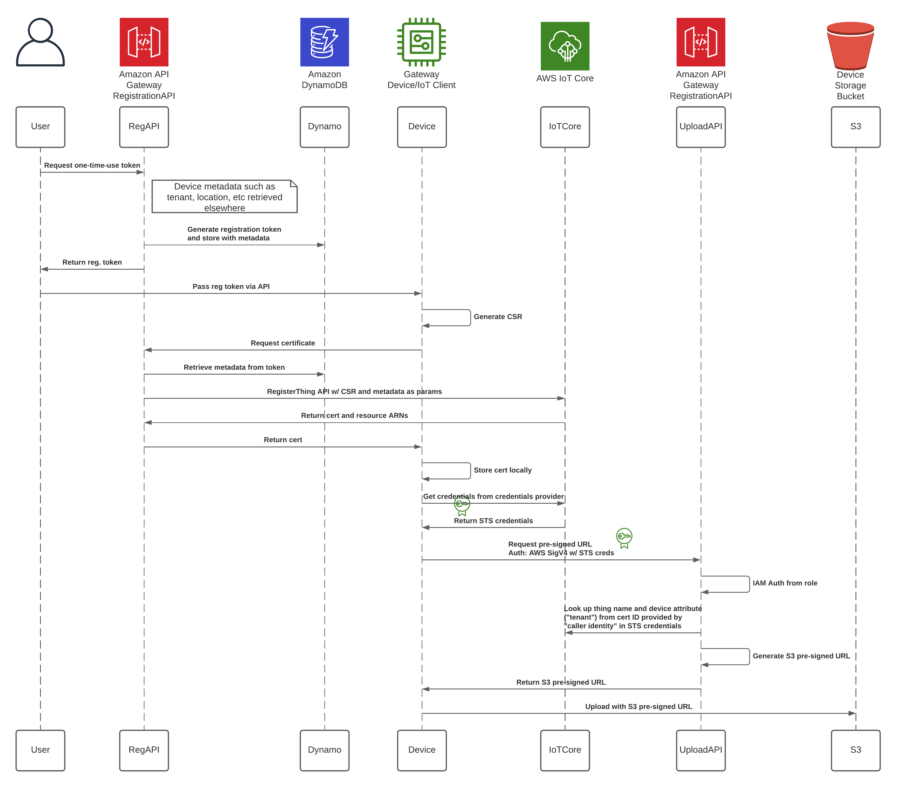

# Device Provisioning via Sideloaded Registration Codes

## Summary

This sample provides an end-to-end demo of using a sideloaded registration code to provision devices.
This solves the use case of allowing an authenticated user the ability to one-time-register
a device without having to be directly connected to it or offline.

This sample also contains some useful code snippets/libraries to demo the following:
1) CDK integration with Chalice to deploy API Gateway APIs, Lambda functions, DynamoDB tables, and S3 buckets
2) Narrowly scoped IoT policies with policy variables and AWS IoT Credential Provider permissions
3) AWS IoT Credential Provider API calls
4) AWS SigV4 Authentication for API Gateway API calls

### Architecture Overview

Below is a sequence diagram and overview diagram for this demo.

### AWS Services Used
- AWS API Gateway
- AWS Lambda
- Amazon DynamoDB
- AWS Lambda
- AWS IoT Credential Provider
- AWS CDK
- AWS Chalice

### Difficulty Level
300

### Prerequisites

- Admin-level permissions due to the creation of IAM resources
- Python or Docker installed

## Set Up

### Project layout

This project has 2 parts: The IoT Client and the Registration API.

Once fully deployed, the registration API portion includes a CDK application and a Chalice application.
These correspond to a ``infrastructure`` and ``runtime`` directory
respectively.  To run any CDK CLI commands, ensure you're in the
``infrastructure`` directory, and to run any Chalice CLI commands ensure
you're in the ``runtime`` directory.

The IoT client portion has the IoT client, the aws_auth library for AWS SigV4 auth,
the requirements file with the required dependencies, and the Dockerfile.

### Infrastructure and API deployment

First, you'll need to install the AWS CDK if you haven't already.
The CDK requires Node.js and npm to run.
See the `Getting started with the AWS CDK
<https://docs.aws.amazon.com/cdk/latest/guide/getting_started.html>`__ for
more details.

`npm install -g aws-cdk`

Next you'll need to install the requirements for the API to deploy it with CDK.

There are two ways to do this. Either globally from the standard shell or using a virtual environment such as `pipenv`

#### Installing dependencies with pipenv

The recommended way to install Python dependencies is with a virtual environment such as Pipenv. There's an included Pipfile
with the repo that you can use to install all dependencies to run the client. First you'll need to make sure Pipenv is installed.
https://pipenv.pypa.io/en/latest/install/

Then you can use pipenv to install all the Python dependencies.

`pipenv install`

Once all dependencies are installed, you'll need to activate the shell with `pipenv shell`

#### Installing Dependencies Globally

From the root directory, `cd api` and then `pip install -r requirements.txt`

There's also separate requirements files in the ``infrastructure``
and ``runtime`` directories if you'd prefer to have separate virtual
environments for your CDK and Chalice app.

To deploy the application, ``cd`` to the ``infrastructure`` directory.
If this is you're first time using the CDK you'll need to bootstrap
your environment.

### Deploying Code

Once the dependencies are installed, you'll need to bootstrap your AWS account with the resouces the CDK needs.

`cdk bootstrap`

Then you can deploy your application using the CDK.

`cdk deploy`

There will be two pieces of infrastructure left to manually provision that can not be deployed with CloudFormation, and that's
the AWS IoT Credential Provider role alias and the AWS IoT Thing Types.

The creation of the role alias can not be done via the console and must be done via a CLI command:

`aws iot create-role-alias --role-alias <tenant> --role-arn <Role arn from CDK template>`

You'll be using a fake "tenant" as the role alias name. In our case, that tenant name is "acme".
The role arn should come from the "AWSIoTCredentialProviderRole" role that was deployed with the CloudFormation template.

You'll also need to go into the AWS IoT Console and create a Thing Types. This should be named "deviceTypeA".
These Thing Types do not need any configuration other than their names.

### IoT Client Configuration

The IoT client can either be run as a Docker container or a native Python application. In both cases, you'll need to ensure
the correct environment variables are configured. These are:

IOT_ENDPOINT - PREFIX ONLY (everything before ".iot" or "-ats.iot"). This can be found under "Settings" in the IoT console or by running `aws iot describe-endpoint` in the AWS CLI

CREDENTIAL_ENDPOINT - PREFIX ONLY (everything before ".credentials"). This can only be found by running `aws iot describe-endpoint --endpoint-type iot:CredentialProvider` in the AWS CLI

AWS_DEFAULT_REGION - Eg. us-east-1

REG_API - Endpoint of Registration API (eg. https://abc123.execute-api.us-east-1.amazonaws.com)

A sample Docker environment file has been included.

#### Option A - Running natively in Python:

You'll need to make sure the correct environment variables mentioned above are configured. The exact commands to do
this might vary slightly between operating systems and runtime environments. But generally it's accomplished by running 
`$ <KEY>=<VALUE>` for each environment variable.

There are no additional arguments to pass the Python code, so you're ready to start the client.

`python iot_client.py`

#### Option B - Running in Docker
For running with docker, you'll need to build the container locally using the included Dockerfile 

`docker build -t <use any image tag name here> .`

Make sure the previously mentioned environment file has the correct values set and then `docker run` with the following command:

`docker run -p 5000:5000 --env-file docker.env -it <image tag>`

## Demo

Ensure all setup steps are complete, the API has been provisioned successfully, and the IoT client pre-requisites have 
been installed. The overview of the demo steps are as follows:

1) Start IoT client
2) Make API call to get registration token
3) Pass registration token to local IoT client
4) The IoT client will then do the rest on its own including:
    A) Call the Registration API with the token to get a certificate
    B) Initialize the MQTT client with the certificate
    C) Call the AWS IoT Credentials Provider to receive AWS STS credentials
    D) Call the Registration API with a SigV4 authentication header derived from the STS credentials 
    to receive an S3  pre-signed URL
    E) Upload sample data to the S3 bucket created in the CloudFormation stack using the S3 pre-signed URL 

  
 - You will need to make an initial call to the registration API to get a token. When this request is made, the API will
  generate a token as well as dummy metadata including "tenant", "location", "deviceType", and save it all to a DynamoDB table. 
  To do this, you will make a "GET" request to the registration API to retrieve the registration token
The URL is: <endpoint from CloudFormation stack>/api/token

`curl <endpoint>/api/token`
  
Copy the token out of the `curl` response and use it to create another API call to the local IoT client.
The registration token will then be used to authenticate to the backend and retrieve a certificate. The IoT client will
also then be able to complete the demo as previously described. Please note the token expires in 5 minutes.

`curl --request POST '127.0.0.1:5000/regToken' --header 'Content-Type: application/json' \
--data-raw '{"registrationCode": <token from previous request>}'`

If successful, the IoT client should now be able to complete the demo on its own. You'll know everything was successful 
 when the last output from the IoT client is "Successfully uploaded data to S3". Open the S3 bucket that was created
in the CloudFormation template and confirm that the sample data is shown there with a key prefix of 
"<tenant>/<thing_name>/sample_data_".

## Cleanup

1) Delete items out of DynamoDB
2) Delete objects out of S3
3) Delete CloudFormation stack
4) Delete AWS IoT Thing Types
5) Delete AWS IoT Role Aliases

## Security

See [CONTRIBUTING](CONTRIBUTING.md#security-issue-notifications) for more information.

## License

This library is licensed under the MIT-0 License. See the LICENSE file.

